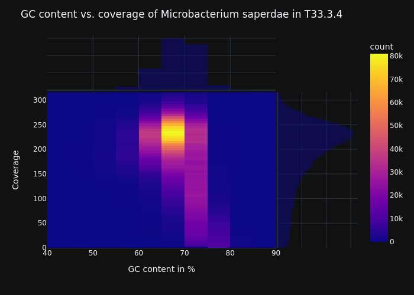

# GC bias visualization

## Introduction

This package allows you to visualize GC bias in sequencing data.
In order to do so, the reference sequence is split into k-mers. K-mer size can be controllable with the flag --window-size. For every k-kmer the GC content and the coverage is calculated. These tuples are then visualized with a 2dhistogram.  
Example output:
  
Here we see an example plot of *Microbacterium saperdae* which has a high average gc content. The plot shows nicely, that there are thousands of k-mers with a very high gc-content and zero coverage. In other words, there are regions in the genome with high GC content that have no sequencing coverage.

## Installation

**This package requires samtools>=1.11 in your PATH.**  
The package can be installed using pip.

```
git clone https://github.com/nahanoo/gc_bias.git
cd gc_bias
pip install .
```

## Usage

Help page called with `plot_gc_bias -h`:  
Labels of the graph are specified in a json file. 
Example labels.json:
```
{
    "title": "Agrobacterium tumefaciens in At34.1",
    "xlabel": "GC content per window",
    "ylabel": "coverage per window",
    "theme": "plotly_dark"
}
```
```
usage: plot_gc_bias [-h] [--window_size WINDOW_SIZE] [--plotting_only]
                    reference bam_file labels output_dir

Plot GC bias with 2d histograms. The GC content in percent is
calculated using a window size. For every window the according
coverage is calculated. GC content and coverage tuples are then
visualized using plotly. This package requires SAMtools in your path.

positional arguments:
  reference             path to reference sequence in fasta.
  bam_file              path to sorted BAM file.
  labels                json file labels for plots. see
                        https://github.com/nahanoo/gc_bias for example
                        file.
  output_dir            output direcotry.

optional arguments:
  -h, --help            show this help message and exit
  --window_size WINDOW_SIZE
                        window size used for GC content calculations
                        [default 150]
  --plotting_only       if added, only the plot will be regenerated.

```